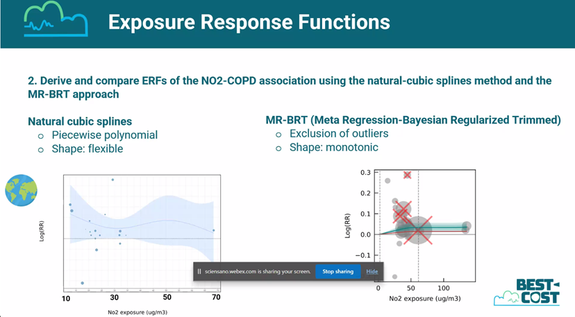

```{r setup, include=FALSE}
rm(list=ls())
library(knitr)
library(tidyverse)
library(readr)
library(viridis)
library(readxl)
knitr::opts_chunk$set(echo = FALSE)
```

## Impressum

All measurement data in this document is available from <https://www.hlnug.de/messwerte/datenportal/luftmessnetz>. The analysis is maintained at <https://github.com/Ma-Loma/Antikor.git> and was performed by Matthias Lochmann (HLNUG) on `r Sys.Date()`.

## Motivation

In the burden-eu webinar with title "Establishing new exposure-response functions for air pollutants and environmental noise", the results of different metaanalyses on NO2 and relative risk of COPD were presented. Depending on the analysis methods and constraints, the risk might have a negative slope. However, this might be due to the correlation of NO2 with O3. As it is likely, that O3 increases the risk of COPD, the negative slope might be due to the correlation of NO2 with O3. This presentation will show the correlation of NO2 and O3 in Hessen (Germany).

```{r}

```


## Measurements from Hessen

```{r load_data, include=FALSE}

bereinigen<-function (string){
  string %>% 
    gsub("ü","ue",.) %>%
    gsub("ö","oe",.) %>%
    gsub("ä","ae",.) %>%
    gsub("aße","",.) %>%
    gsub("trasse","tr",.) %>%
    gsub("ß","ss",.) %>% 
    gsub("[ .,-/]","",.)
}

Stationsnamen_Kategorie <- read_excel("data/Stationsnamen_Kategorie.xlsx") %>% 
  mutate(Station=bereinigen(Station))

Stationsnamen_Kategorie$Category<-Stationsnamen_Kategorie$Category %>% 
  gsub("Verkehr","Urban Traffic",.) %>%
  gsub("Ländlich","Rural Background",.) %>%
  gsub("Stadt","Urban Background",.)

no2Jahresmittel <- read_delim(
  "data/no2.txt",
  delim = ";",
  escape_double = FALSE,
  trim_ws = TRUE,
  locale = locale(decimal_mark = ",")
) %>%
  select(where(function(x)
    ! all(is.na(x)))) %>% 
  mutate(Pollutant="NO2") %>% 
  mutate(Station=bereinigen(Station))

o3Jahresmittel <- read_delim(
  "data/o3.txt",
  delim = ";",
  escape_double = FALSE,
  trim_ws = TRUE,
  locale = locale(decimal_mark = ",")
) %>%
  select(where(function(x)
    ! all(is.na(x)))) %>% 
  mutate(Pollutant="O3") %>% 
  mutate(Station=bereinigen(Station))

beideJahresmittel <- bind_rows(no2Jahresmittel, o3Jahresmittel) %>% 
  pivot_longer(-c(Station, Pollutant), names_to="year", values_to="Concentration")%>% 
  filter(!is.na(Concentration)) %>% 
  mutate(year=as.numeric(year)) %>% 
  left_join(Stationsnamen_Kategorie, by="Station")

beideJahresmittel %>% 
  filter(is.na(Category)) %>% 
  .$Station %>% 
  unique()

names1<-read_lines("data/Tagesmittelwerte seit 2005.txt", n_max = 1) %>%
  str_split(";") %>% 
  unlist()

names2<-read_lines("data/Tagesmittelwerte seit 2005.txt",skip=1, n_max = 1) %>%
  str_split(";") %>% 
  unlist()

namesAll<-names1 %>% 
  paste(names2, sep = "_")

tageswerte <- read_delim(
  "data/Tagesmittelwerte seit 2005.txt",
  delim = ";",
  escape_double = FALSE,
  trim_ws = TRUE,
  locale = locale(decimal_mark = ","),
  na = c("", "NA", "#", "Dfue"),
  skip = 3,
  col_names = namesAll
) %>%
  mutate(
    time = Zeitpunkt_ %>%
      dmy() %>%
      lubridate::as_date(),
    .keep = "unused",
    .before = 1
  )

tageswerteLong<-tageswerte %>%
  #pivot_longer(!time,names_sep="_", names_to="Pollutant", values_to="Concentration")
  pivot_longer(
    !time,
    cols_vary = "slowest",
    names_to = c("Station",".value"),
    names_sep = "_"
  ) %>% 
  pivot_longer(
    cols = c(NO2, O3),
    names_to = "Pollutant",
    values_to = "Concentration"
  ) %>% 
  filter(!is.na(Concentration)) %>%
  mutate(Station=bereinigen(Station)) %>% 
  left_join(Stationsnamen_Kategorie, by="Station")
```

Measured NO2 and O3 concentrations as annual averages since 2005. The measurement site categories are symbolized as different colors. O3 is measured at "Rural Background" sites, but not routinely measured at "Urban Background" and not at all at "Urban Traffic" sites. See yearly averages at next slide.

## NO2 and O3 yearly averages

```{r jahresmittelverlauf, fig.asp = 0.5, fig.width = 10}
pl1<-beideJahresmittel %>% 
  ggplot(aes(x=year, y=Concentration, group=Station,color=Category))+
  geom_line(aes(group=Station))+
  facet_wrap(vars(Pollutant), scales="free_y")+
  labs(x="year",y="Concentration yearly average [µg/m³]")
pl1
```

## Correlation of NO2 and O3

The next scatterplot of yearly average values since 2005 shows a strong negative correlation of concentrations of NO2 and O3. As some stations are only measuring NO2, the O3 missing values are artificially set to 30 or 31 µg/m³, for "Urban Traffic" and "Urban Background" sites respectively. However, these sites are expected to have low O3 concentrations, so this would fit to the negative correlation. (The years are gradually color coded, to make visible the time trend. The time trend might be interesting, but is not the main focus of this analysis.)

## Correlation of NO2 and O3

```{r jahresmittelcorrelation, fig.asp = 0.5, fig.width = 13}

beideJahresmittel %>%
  pivot_wider(names_from = Pollutant, values_from = Concentration) %>%
  mutate(O3=if_else(is.na(O3)&Category=="Urban Traffic",30,O3)) %>%
  mutate(O3=if_else(is.na(O3)&Category=="Urban Background",31,O3)) %>%
  ggplot(aes(x = NO2, y = O3)) +
  xlab("NO2 yearly average") + ylab("O3 yearly average") +
  geom_point(aes(color = factor(year),shape = Category)) +
  geom_line(aes(color = factor(year), group = Station)) +
  scale_color_viridis(discrete=TRUE, option="viridis")+
#  facet_wrap(vars(Category))+
  coord_cartesian(xlim = c(0, 40), ylim = c(30, 85))+
  scale_shape_manual(values = c(2:4))+ 
  guides(
    colour = guide_legend(
      title = "Year")
  )
```


## Daily resolution

Although the longterm epidemiological studies are based on yearly averages, the daily resolution might be interesting for the correlation of NO2 and O3.
The daily resolution of NO2 and O3 concentrations shows a similar negative correlation. The scatterplot is faceted by the measurement site category and the quarter of the year. (Again, the time is color coded, but not the main focus of the analysis.)

## Daily resolution

```{r dailyresolution, fig.asp = 0.5, fig.width = 13, fig.dpi=300}

tageswerteLong %>%
  mutate(Quartal = lubridate::quarter(time, fiscal_start = 12) %>% paste0("Q", .)) %>%
  mutate(
    Quartal = Quartal %>%
      gsub("Q1", "Dec-Feb", .) %>%
      gsub("Q2", "Mar-Mai", .) %>%
      gsub("Q3", "Jun-Aug", .) %>%
      gsub("Q4", "Sep-Nov", .)
  ) %>%
  mutate(Quartal = factor(Quartal, levels = c(
    "Dec-Feb", "Mar-Mai", "Jun-Aug", "Sep-Nov"
  ))) %>%
  #  slice_sample(n=100000) %>%
  pivot_wider(names_from = Pollutant, values_from = Concentration) %>%
  ggplot(aes(x = NO2, y = O3)) +
  xlab("NO2 daily average [µg/m³]") + ylab("O3 daily average [µg/m³]") +
  geom_point(aes(color = time), shape = ".") +
  #geom_line(aes(color = time, group = Station)) +
  scale_color_viridis(discrete = FALSE,
                      option = "viridis",
                      labels = as.Date) +
  facet_grid(rows = vars(Category), cols = vars(Quartal)) +
  coord_cartesian(xlim = c(0, 80), ylim = c(0, 160))

```

## Conclusion

The analyised data consists only of measurement data from Hessen, Germany and does not include O3 measurements at urban traffic sites. However, the observed anticorrelation, might be representative for other regions with similar climate and emission patterns.

Most probably, there might be a truly protective effects of NO2 via the destruction of O3. The negative slope of NO2 and relative risk of COPD (when using natural cubic spline method) is not necessarly wrong, when using a single pollutant model without confounder adjustment for O3.

## Counterfactual model

If staying with the single pollutant model, the counterfactual model could be NO2 concentration=0 or TMREL, but with O3 unchanged.